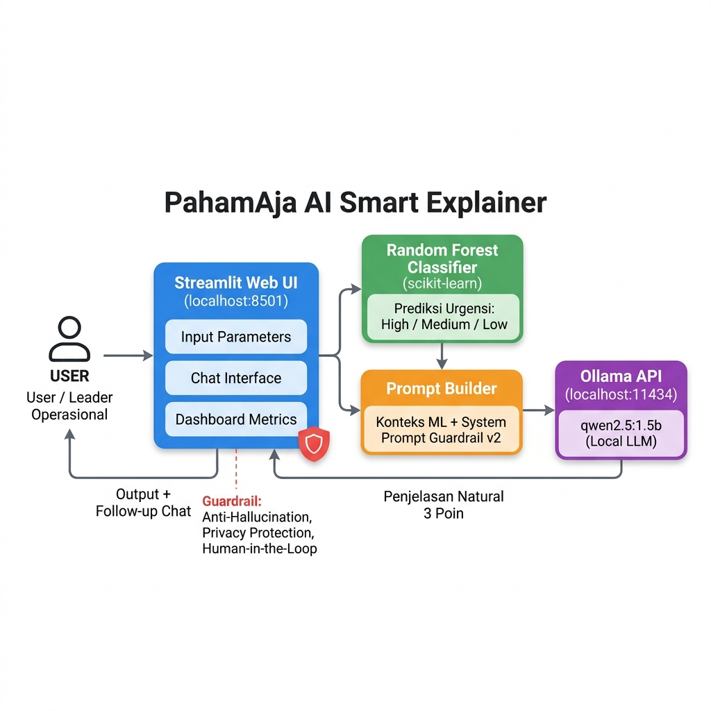

# 🤖 PahamAja AI Smart Explainer



PahamAja AI Smart Explainer adalah aplikasi **Hybrid AI (Machine Learning + Local LLM)** yang dirancang untuk membantu evaluasi dan pemahaman Standar Operasional Prosedur (SOP) bagi personel operasional parkir (Petugas Gate, Kasir, dan Leader).

Proyek ini dibangun sebagai Tugas Akhir (UAS) mata kuliah Artificial Intelligence, dengan mengedepankan efisiensi eksekusi lokal (tanpa GPU), keamanan privasi data (100% On-Premise), dan *Responsible AI*.

---

## 🚀 Fitur Utama

1. **Prediksi Urgensi Cerdas (Machine Learning)**
   Menggunakan algoritma **Random Forest Classifier** (`scikit-learn`) untuk memprediksi tingkat urgensi pelatihan ulang (High/Critical, Medium, Low) berdasarkan 4 parameter operasional:
   - Skor Kuis SOP
   - Jumlah Kesalahan Operasional
   - Jenis Shift (Pagi/Malam)
   - Masa Kerja

2. **Penjelasan Natural & Kontekstual (Local LLM)**
   Terintegrasi dengan **Ollama (qwen2.5:1.5b)** untuk menerjemahkan hasil prediksi ML menjadi penjelasan bahasa Indonesia yang ramah, ringkas (3 poin utama), dan mudah dipahami oleh personel lapangan.

3. **Follow-Up Chat Interaktif**
   Personel dapat melakukan tanya jawab lanjutan (chat) dengan AI mengenai hasil evaluasi mereka tanpa kehilangan konteks awal.

4. **Responsible AI Guardrails**
   Dilengkapi dengan *System Prompt* ketat untuk:
   - Mencegah Halusinasi informasi (Anti-Hallucination).
   - Menolak permintaan data pribadi NIK/HP (Privacy Protection).
   - Menolak instruksi sabotase sistem.
   - Mengingatkan bahwa keputusan sanksi tetap berada di tangan Leader manusia (*Human-in-the-Loop*).

---

## 🛠️ Tech Stack

- **Antarmuka (UI):** [Streamlit](https://streamlit.io/)
- **Machine Learning:** `scikit-learn`, `pandas`, `numpy`
- **Large Language Model (LLM):** [Ollama](https://ollama.com/) (Model: `qwen2.5:1.5b` / `llama3.2:1b`)
- **Generator Dokumen:** `python-docx`, `python-pptx`

---

## ⚙️ Cara Instalasi & Menjalankan Aplikasi

### 1. Prasyarat
- Python 3.10 atau lebih baru terinstal.
- [Ollama](https://ollama.com/) terinstal di perangkat lokal.

### 2. Download Model Ollama
Buka terminal / Command Prompt, lalu jalankan:
```bash
ollama pull qwen2.5:1.5b
```

### 3. Install Dependensi Python
Clone repositori ini, buka terminal di folder proyek, lalu install library yang dibutuhkan:
```bash
pip install -r requirements.txt
```

### 4. Jalankan Aplikasi
Buka terminal dan pastikan Ollama berjalan di latar belakang (bisa dengan `ollama serve`), lalu jalankan:
```bash
streamlit run app.py
```
Aplikasi akan terbuka secara otomatis di browser pada `http://localhost:8501`.

---

## 📂 Struktur Proyek

```text
├── app.py                            # Kode utama aplikasi Streamlit (UI, ML, LLM)
├── dataset_evaluasi_personel.csv     # Dataset sintetis yang di-generate otomatis
├── requirements.txt                  # Daftar pustaka Python
└── architecture_diagram.png          # Diagram arsitektur sistem
```

---

## 📜 Lisensi & Integritas Akademik

Proyek ini disusun oleh **Daffa Rizki Ariyanto (NIM: 24130300001)** untuk memenuhi syarat Ujian Akhir Semester Genap 2025/2026 mata kuliah Artificial Intelligence. Penggunaan *open-source tools* (Ollama, Scikit-Learn) telah dicantumkan dengan jujur. Keluaran AI bersifat rekomendasi operasional dan tidak menggantikan keputusan manajerial (*Human-in-the-Loop*).
